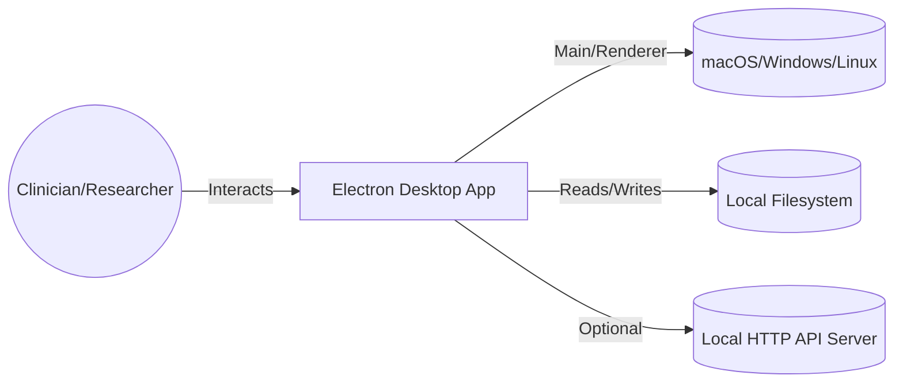
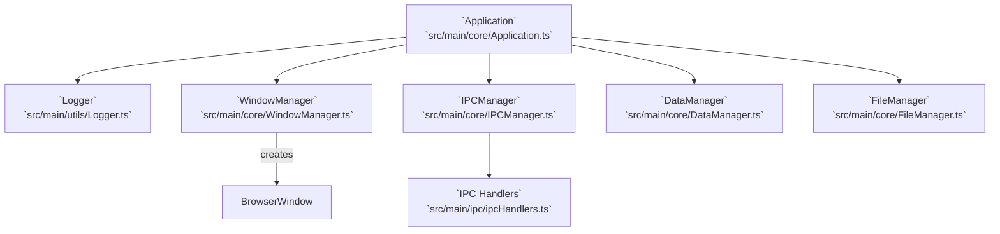
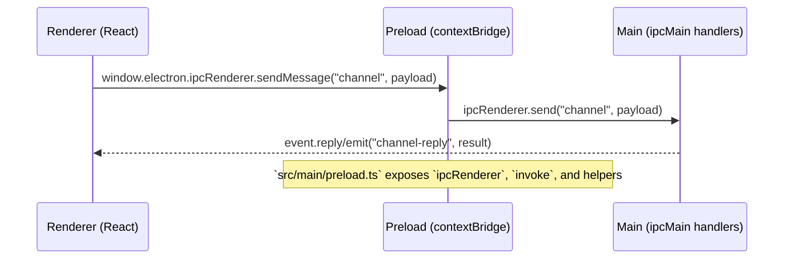
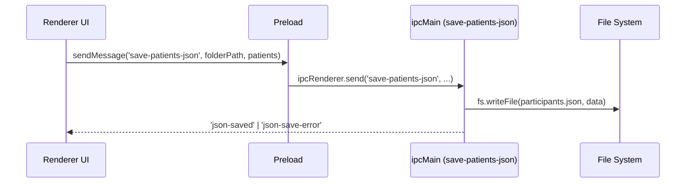
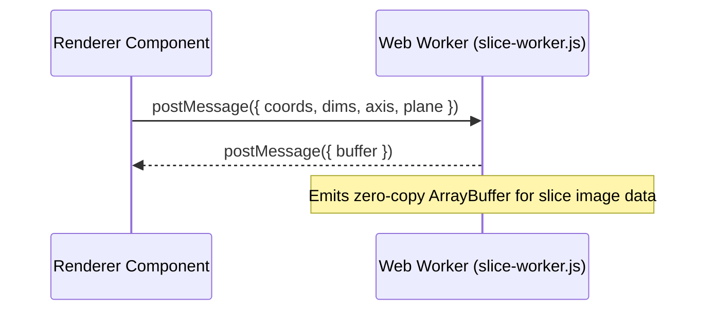
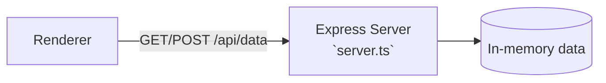
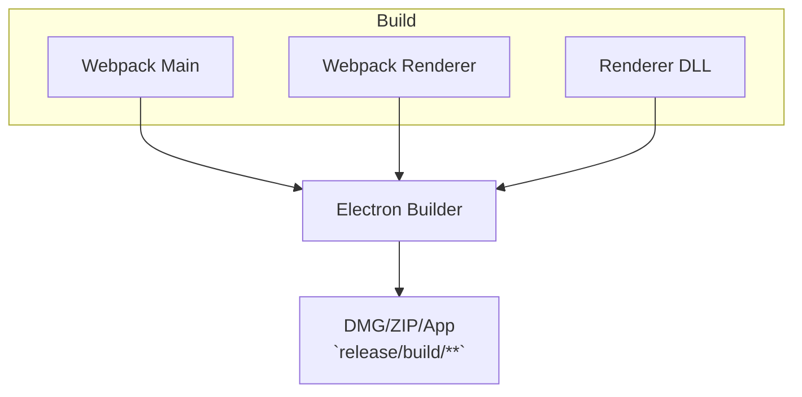

## LeadDBS Programmer — System Architecture

This document provides a high-level and component-level view of the Electron-based application, its renderer (React), the main process, IPC bridge via preload, background workers, assets, and the optional local HTTP server.

### High-Level Context



### Container View

```mermaid
flowchart TB
  subgraph ElectronApp[Electron Application]
    direction LR
    Main[Main Process\n`src/main/main.ts`\n`src/main/core/*`\n`src/main/ipc/ipcHandlers.ts`]
    Preload[Preload Script\n`src/main/preload.ts`]
    Renderer[Renderer (React)\n`src/renderer/**/*`\n`src/renderer/pages/App.tsx`]
  end

  Assets[Assets/Templates\n`assets/`, `public/*.xlsx`]
  Workers[Workers (Web/Node)\n`src/renderer/workers/slice-worker.js`\n`src/renderer/niivue/electron/worker.js`]
  LocalAPI[Optional Local Express Server\n`server.ts`]
  Release[Packaging\n`release/`]

  Main <--> Preload
  Preload <--> Renderer
  Renderer --> Workers
  Renderer -. HTTP fetch .-> LocalAPI
  Main --> Assets
  Renderer --> Assets
  ElectronApp --> Release
```

### Main Process Components



### IPC Bridge and Preload Exposure



### Example: Save Patients JSON Flow



### Renderer Overview

```mermaid
flowchart TB
  subgraph React[React App]
    Pages[Pages\n`src/renderer/pages/App.tsx`, `Programmer.tsx`]
    Components[Components\nanalysis/*, electrode/*, patient/*, viewers/*]
    Contexts[Contexts\n`contexts/PatientContext.tsx`]
    Utils[Utils\n`utils/*.js` (ClinicalScores, OptimizeDatabase, NiftiUtils, etc.)]
  end

  Niivue[Niivue UI/Processing\n`src/renderer/niivue/**/*`]
  Workers[Workers\n`workers/slice-worker.js`, `niivue/electron/worker.js`]

  Pages --> Components
  Components --> Contexts
  Components --> Utils
  Components --> Niivue
  Niivue --> Workers
```

### Worker Usage



### Optional Local HTTP API Server



### Build and Packaging



### Key File References

- Main entry: `src/main/main.ts` and `src/main/core/Application.ts`
- Window creation: `src/main/core/WindowManager.ts`
- IPC registration: `src/main/core/IPCManager.ts`, `src/main/ipc/ipcHandlers.ts`
- Preload bridge: `src/main/preload.ts`
- Renderer entry: `src/renderer/index.tsx`, pages in `src/renderer/pages/*`
- Workers: `src/renderer/workers/slice-worker.js`, `src/renderer/niivue/electron/worker.js`
- Optional server: `server.ts`
- Assets/templates: `assets/`, `public/*.xlsx`
- Packaging outputs: `release/`


